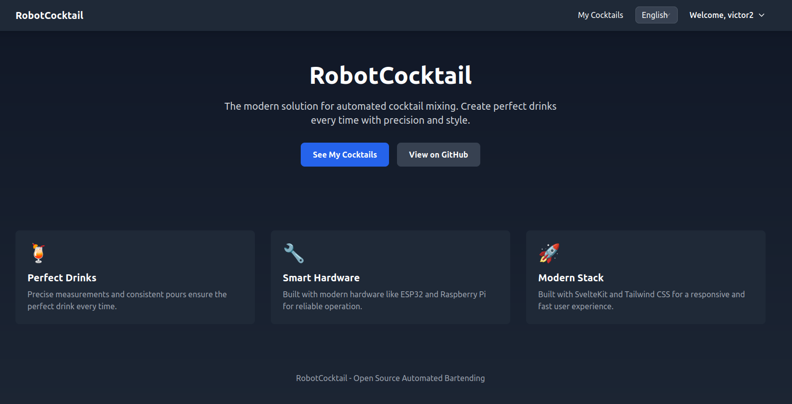
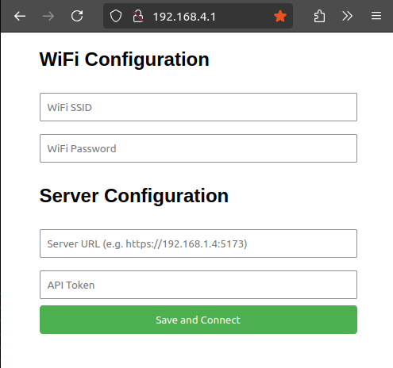

# RobotCocktail

A web platform and hardware solution for automated cocktail mixing machines.



## Overview

RobotCocktail is a modern reimagining of the [Autobar v1 project](https://github.com/vtalpaert/autobar). While the original project used Django and Raspberry Pi, this new version brings several key improvements:

- Modern web interface built with SvelteKit and Tailwind CSS
- User authentication and management
- Support for multiple hardware implementations (ESP32, Raspberry Pi)
- Over-the-air (OTA) updates for connected devices
- RESTful API for device communication

## Components

The project consists of two main parts:

1. **Web Platform**
   - User authentication and management
   - Cocktail recipe database with ingredients and doses
   - Device management interface
   - API endpoints for device communication

2. **Hardware Implementation**
   - ESP32-based cocktail mixing machine (primary target)
   - Support for legacy Raspberry Pi implementation
   - Automated OTA updates
   - Weight-based pour measurement
   - Multiple pump control

## Getting Started

First, generate SSL certificates for local development:

```bash
./scripts/generate_dev_certificates.sh
```

This script generates:

- Self-signed certificates for HTTPS development server
- A PEM file for ESP32 firmware to verify HTTPS connections
- These certificates are for development only and should not be used in production

### Hardware

The firmware is built locally into the `static/firmware` folder so that user may flash their device the first time via a webpage.

#### Configure using the access point



#### Develop the firmware

The following instructions are intended for VS Code

```bash
sudo apt-get install git wget flex bison gperf python3 python3-pip python3-venv cmake ninja-build ccache libffi-dev libssl-dev dfu-util libusb-1.0-0
```

Install the ESP-IDF plugin and configure the extension. Version v5.3.2 is the only one tested for now.
Building the project will copy the firmware binaries to the static folder.

### Web

Install dependencies and start the development server:

```bash
npm install
npm run dev
```

The development server will run with HTTPS using the generated self-signed certificates.

Note: For production deployment, replace the development certificates with proper SSL certificates from a trusted Certificate Authority.

## Contributing

Please see [CONTRIBUTING.md](CONTRIBUTING.md) for development guidelines and contribution process.

## License

This project is licensed under the MIT License - see the [LICENSE](LICENSE) file for details.
