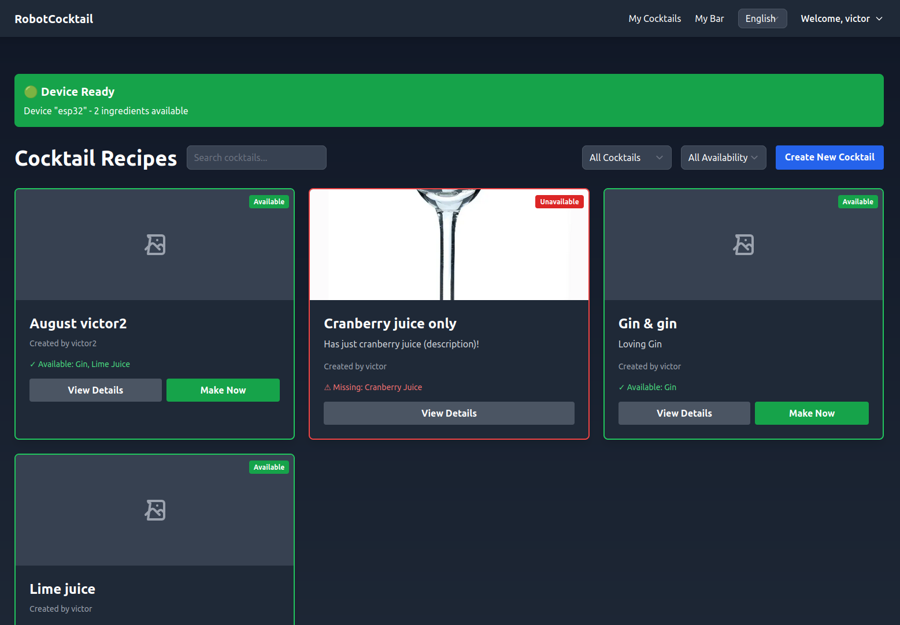
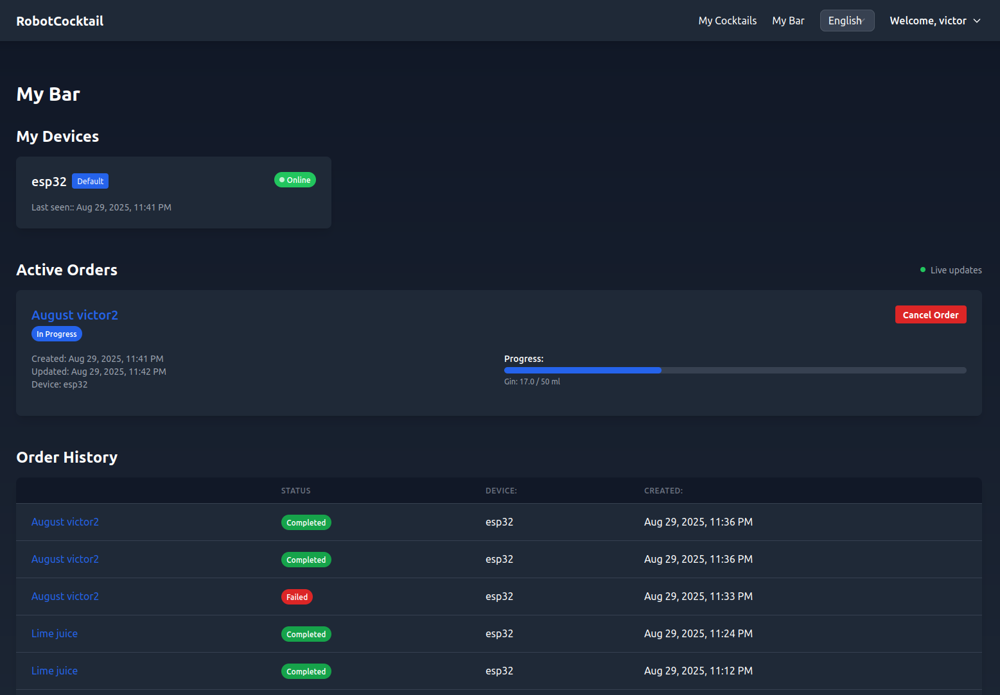
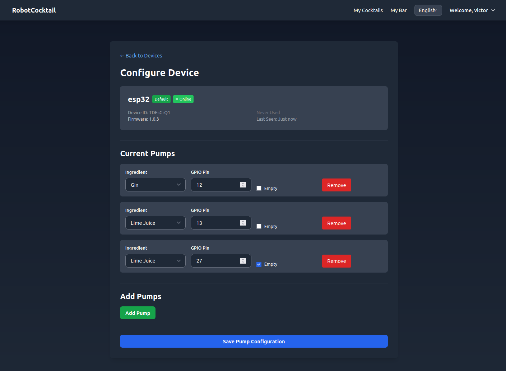
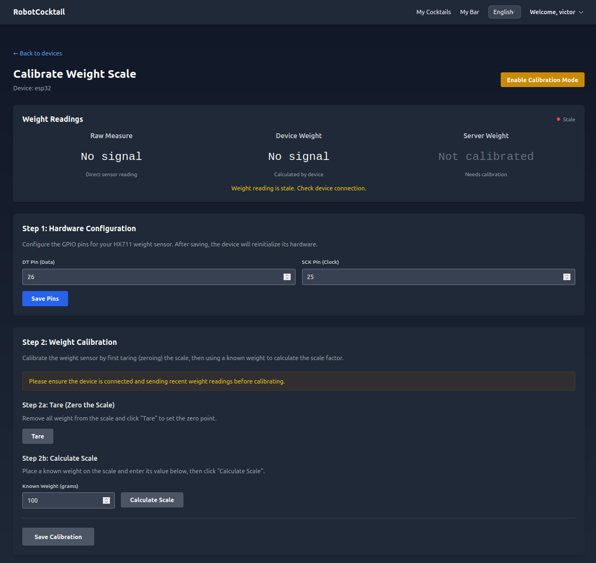

# RobotCocktail

A web platform and hardware solution for automated cocktail mixing machines.


## Overview

RobotCocktail is a modern reimagining of the [Autobar v1 project](https://github.com/vtalpaert/autobar). While the original project used Django and Raspberry Pi, this new version brings several key improvements:

- Modern web interface built with SvelteKit and Tailwind CSS
- User authentication and management
- Support for multiple hardware implementations (ESP32, Raspberry Pi)
- Over-the-air (OTA) updates for connected devices
- RESTful API for device communication

## Image gallery

### With some debug data




### Device configuration and calibration




## Components

The project consists of two main parts:

1. **Web Platform**
   - User authentication and management
   - Cocktail recipe database with ingredients and doses management
   - Device management interface
   - [API endpoints](docs/api.md) for device communication
   - Cocktail creation and editing with ingredient doses
   - Artist collaboration system for joint cocktail creation
   - Order management system for cocktail preparation
   - Device simulator for testing order processing without physical hardware

2. **Hardware Implementation**
   - ESP32-based cocktail mixing machine (primary target)
   - Support for legacy Raspberry Pi implementation (todo)
   - Automated OTA updates (todo)
   - Weight-based pour measurement
   - Multiple pump control

### ESP32 configuration using the access point

Using the Devices page, use "Flash New Device" and then "Enroll via WiFi" for instructions. You should obtain a page as below.


## Getting Started with Docker

If you have docker installed, you might prefer to run the project for a quick demo by using:

```bash
docker build -t autobar3 .
docker run --rm -it autobar3
```

The admin authentification is in `.env.example`. You may change the values before building the image.

## Local development

### Certificates

First, generate SSL certificates for local development:

```bash
./scripts/generate_dev_certificates.sh
```

This script generates:

- Self-signed certificates for HTTPS development server
- A corresponding PEM file shipped inside the ESP32 firmware in order to verify HTTPS connections

> These certificates are for development only and should not be used in production

### Develop the firmware

The firmware is built locally into the `static/firmware` folder so that user may flash their device the first time via the webpage.

#### Using the ESP-IDF plugin VS Code

The following dependencies are required

```bash
sudo apt-get install git wget flex bison gperf python3 python3-pip python3-venv cmake ninja-build ccache libffi-dev libssl-dev dfu-util libusb-1.0-0
```

Install the ESP-IDF plugin and configure the extension. Version v5.3.2 is the only one tested for now.
The `CMakeLists.txt` includes commands to copy the firmware binaries to the static folder.

#### Using docker

(TODO) VS Code devcontainer or pure docker command

### Web

Install dependencies and start the development server:

```bash
npm install
npm run dev
```

The development server will run with HTTPS using the generated self-signed certificates.

> Note: For production deployment, replace the development certificates with proper SSL certificates from a trusted Certificate Authority.

## Contributing

Please see [CONTRIBUTING.md](CONTRIBUTING.md) for development guidelines and contribution process.

## License

This project is licensed under the MIT License - see the [LICENSE](LICENSE) file for details.
